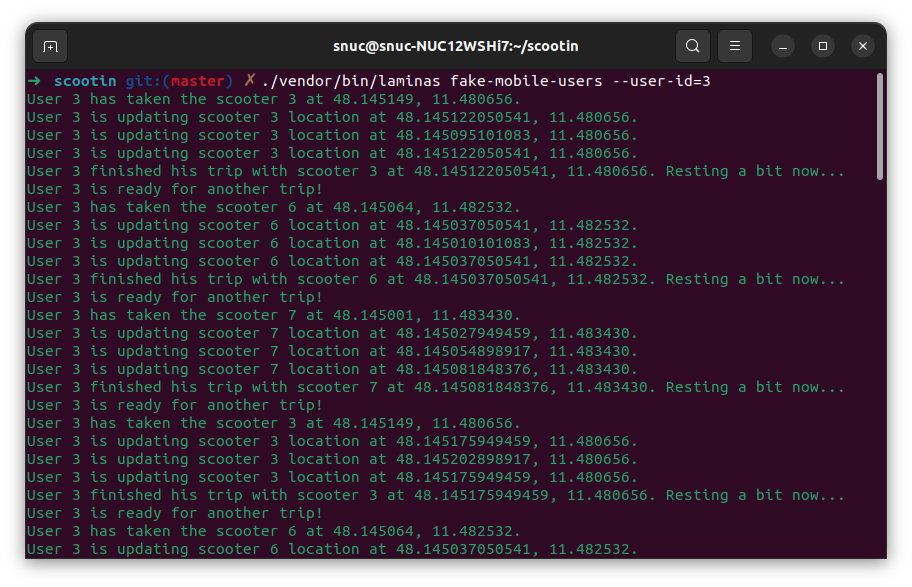
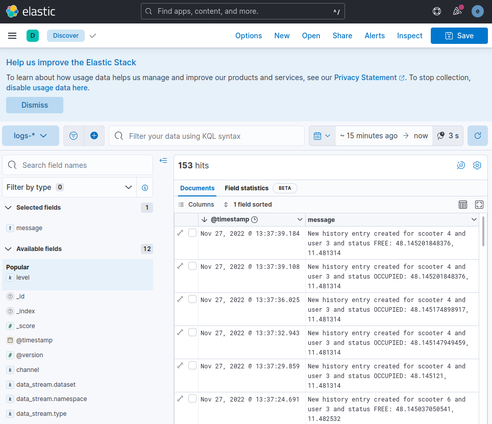

# Scootin' Aboot

Implementation details about the REST API as well as some extra tools created for the Scootin' Aboot.

## Summary of technologies used:

- PHP 8.1
- Laminas framework
- MySQL
- ELK stack
- PHPUnit
- PHP CodeSniffer
- PHPStan
- Doctrine ORM
- Doctrine Migrations
- Docker
- Composer
- Swagger
- Basic Authentication
- Basic CI pipeline for running PHPUnit Tests and PHPStan (Github Actions)
- Guzzle for dispatching HTTP requests
- Symfony Command for the CLI which will act as fake mobile users

## How to run the project

The easiest way is with Make command:

- Clone the project 
- Inside the folder run `make build` it will do these things for you:
  - Containers will be built
  - Composer will run
  - Migrations will run

The other way is:

- Inside the folder
- Build and start docker containers
  - `docker-compose up -d`
- Run composer
  - `docker exec php-fpm composer install`
- Run the migrations
  - `docker exec php-fpm ./vendor/bin/doctrine-migrations migrate`

## Available URLs

- REST API running at http://localhost:8080
- Kibana running at http://localhost:5601 username: elastic | password: password
- Swagger Documentation running at http://localhost:9001

## The CLI to dispatch fake clients

There is a CLI which you can use in order to dispatch some fake clients. You can run as many instances as you need in separated terminal windows.

You can use the command `./vendor/bin/laminas fake-mobile-users --user-id=3` and then watch it running:

Plus you can monitor on Kibana what's going on:

## Extra notes

I've used basic authentication for all endpoints here and a single user is stored in the apikeys table: username is "mobile" and password is "oZq!63ydPHB0".

I've written only a few unit tests for the Scooter module.